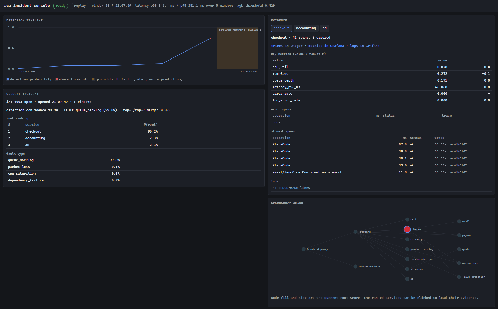
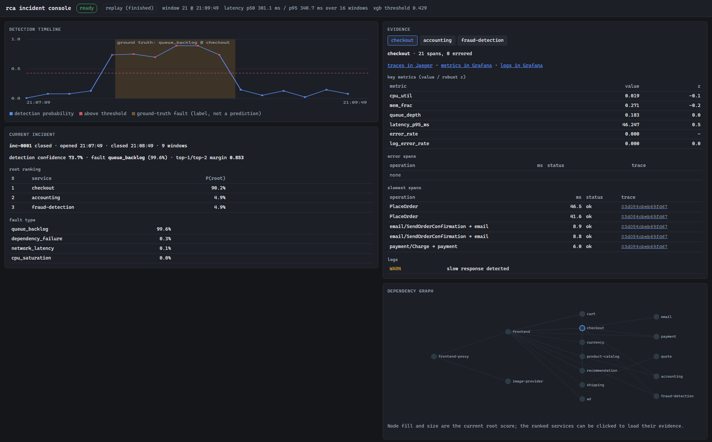

> **Public snapshot.** This repository is a snapshot of a private development
> repository. The full commit history and ongoing work live privately; what you see here
> is the source at a point in time.

# Cloud-Outage Root-Cause AI

An ML system that watches the telemetry of a running microservice application, detects
that an outage is happening, ranks which service is most likely the root cause,
classifies what kind of fault it is, and links the verdict to the evidence behind it.

It is a trained model over metrics, traces and logs — **not an LLM wrapper**. Nothing in
the diagnostic path calls a language model. The work is dataset generation under
controlled fault injection, telemetry feature construction, model training against
rule-based and statistical baselines, leakage-safe evaluation, and streaming inference.

## Features

- **Fault injection into the [OpenTelemetry
  Demo](https://github.com/open-telemetry/opentelemetry-demo)** — a real, instrumented
  microservice application is broken on purpose through real mechanisms: cgroup CPU
  burners, memory balloons, `tc netem`, container pausing, and the demo's own feature
  flags.
- **Eight fault families** — CPU saturation, memory leaks, network latency, packet loss,
  dependency failures, elevated error rates, queue backlogs and cache slowdowns.
- **Labels without hand-labelling** — the injector records what it broke, where and when,
  so every experiment ships its own ground truth. Fault-free runs and traffic-only spikes
  are generated as hard negatives.
- **A telemetry simulator** that emits the same data contract as the real benchmark, so
  the whole pipeline can be developed, tested and ablated without Docker.
- **A feature pipeline** over fixed-width windows: RED metrics, resource utilization,
  robust z-scores against each experiment's own warm-up baseline, trace-derived self vs.
  child latency, log error rates, service-graph aggregates and trailing-window context.
- **A three-stage model** — detect that an incident is in progress, rank the root-cause
  service, classify the fault family — each stage reporting a calibrated probability.
- **Baselines to measure against** — threshold rules of the kind monitoring stacks ship
  with, an untrained signature scorer, a robust z-score detector, logistic regression,
  random forest and XGBoost.
- **Leakage-safe evaluation** — splits by experiment rather than by window, plus
  held-out-service, held-out-intensity, held-out-traffic and temporal splits; cluster
  bootstrap intervals; ablations and degraded-telemetry robustness runs; MLflow tracking.
- **Streaming inference** over a live collector feed or a recorded experiment, computing
  features identically to the offline pipeline.
- **Replay** of any past experiment through the detector, for debugging and comparison.
- **An incident console** — a barebones browser UI showing the detection timeline, the ranked
  root-cause services with confidence, the supporting evidence, and the dependency graph.

## Screenshots



*An incident opening: detection probability crosses the threshold, the suspected service
is highlighted in the dependency graph, and its metrics, slowest spans and logs are
pulled up as evidence.*



*The same incident after it closed, with the full detection timeline against the
ground-truth fault window, the final ranking and the fault-class distribution.*

## Architecture

```
fault injection ──┐
                  ├─→ canonical experiment ──→ windowed features ──→ three-stage model
telemetry sim ────┘   (manifest + metrics       (per experiment,      1. detect
                       + spans + logs)           window, service)     2. rank root service
                                                                      3. classify fault
                                                                              │
                                    incident console ←── streaming inference ─┘
                                    (timeline, ranking,   (live feed or replay)
                                     evidence, graph)
```

Experiments are produced either by injecting faults into the running OpenTelemetry Demo
or by the simulator, and both write the same on-disk contract: a manifest carrying the
ground-truth fault and the dependency graph, plus metrics, spans and logs. Everything
downstream is source-agnostic.

The feature pipeline turns an experiment into one row per (experiment, window, service).
The model scores those rows in three stages: a system-level detector decides whether an
incident is in progress, a per-service candidate scorer ranks the services of a flagged
window, and a classifier labels the fault family from the top-ranked service's row. The
localizer never sees a service-identity feature, which is what makes held-out-service
evaluation meaningful.

At serving time the same feature code runs over a live or replayed telemetry stream, and
the incident console reads the resulting incidents, rankings and evidence over an HTTP
API.

## Tech stack

Python · pandas · PyArrow · scikit-learn · XGBoost · FastAPI · Uvicorn · MLflow · Typer ·
pytest · ruff · Docker Compose · OpenTelemetry Collector · flagd · `tc`/netem

## Project layout

| path | contents |
| --- | --- |
| `rca/data` | canonical experiment contract and leakage-safe splits |
| `rca/benchmark` | collector configuration, fault injector, campaign runner, OTLP-JSON ingest |
| `rca/sim` | telemetry simulator emitting the same contract |
| `rca/features` | windowing, robust baselines, and the metrics/traces/logs/graph/temporal features |
| `rca/models` | the three stages, the baselines, calibration and hyperparameter tuning |
| `rca/eval` | detection, localization and classification metrics, ablations, robustness, MLflow |
| `rca/serve` | streaming detector, incident store, FastAPI API and the incident console |
| `deploy/compose` | running the OpenTelemetry Demo as the benchmark |
| `deploy/k8s` | Kubernetes manifests and Helm values for the inference service; see the directory README for its deployment status |
| `scripts` | campaign runner and real-campaign evaluation |
| `docs` | design and results documentation |
| `tests` | test suite |

## Installation

Requires Python 3.12 or newer.

```bash
git clone https://github.com/arthursusanto/rcAI.git
cd rcAI
python -m venv .venv
.venv/Scripts/pip install -e ".[dev]"      # Windows;  .venv/bin/pip on Linux/macOS
```

This installs the `rca` command line entry point into the virtual environment
(`.venv/Scripts/rca` on Windows, `.venv/bin/rca` elsewhere).

## Quickstart

The simulator produces the same data contract as the real benchmark, so the full pipeline
runs without Docker or the OpenTelemetry Demo.

```bash
# Generate a labelled dataset of randomized experiments.
rca sim generate --out data/experiments --n 400 --seed 1000

# Build the window table.
rca features build --experiments data/experiments --out data/windows.parquet

# Train every model on the same leakage-safe split and compare them.
rca eval --windows data/windows.parquet --experiments data/experiments \
         --split by-experiment --models rules,stat,logreg,rf,xgb \
         --out artifacts/eval/by-experiment

# Fit and save a single model.
rca train --windows data/windows.parquet --experiments data/experiments \
          --model xgb --out artifacts/xgb

# Replay one experiment through the streaming detector.
rca replay --model artifacts/xgb --experiment data/experiments/<experiment-id>

# Serve the incident console over that replay:  http://localhost:8000
rca serve --model artifacts/xgb --replay data/experiments/<experiment-id> --speed 10
```

Choose any `<experiment-id>` from `ls data/experiments`; pass `--port` to `rca serve` if
8000 is already taken.

Other things the CLI can do:

```bash
# Generalization splits.
rca eval ... --split holdout-service|holdout-intensity-high|holdout-intensity-low|holdout-traffic|by-time

# Require consecutive positive windows before alarming.
rca eval ... --debounce 2

# Degraded-telemetry and per-modality ablation tables.
rca eval ... --robustness --ablation

# Cross-validated hyperparameter search.
rca tune --windows data/windows.parquet --experiments data/experiments --models xgb --out artifacts/tune
```

Runs are tracked in a local MLflow store under `mlruns/`.

## Running against the real benchmark

Collecting real data needs Docker and the OpenTelemetry Demo. The procedure:

1. Clone the OpenTelemetry Demo and copy in this repository's collector configuration and
   compose override, which add a file exporter for the telemetry capture and set uniform
   container CPU limits.
2. Bring the stack up with the base, full and override compose files.
3. Run a fault-injection campaign. `scripts/campaign.ps1` drives this unattended and is
   resumable — re-running the same command skips the chunks that already finished.
4. Build features from the collected experiments with the same `rca features build` step
   as the simulated path.
5. Evaluate with `scripts/real_eval.py`, which scores the campaign with grouped
   cross-validation across three training regimes: zero-shot from the simulator,
   real-only, and simulated plus real.

[`deploy/compose/README.md`](deploy/compose/README.md) is the full walkthrough, including
each fault mechanism and its limitations. `rca serve --capture <demo-dir>/rca-capture`
runs the detector live against the collector's output instead of a replay.

## Tests

```bash
.venv/Scripts/python -m pytest -q
ruff check .
```

## Documentation

- [`docs/MODELS.md`](docs/MODELS.md) — modelling and evaluation design.
- [`deploy/compose/README.md`](deploy/compose/README.md) — running the real benchmark.
- [`deploy/k8s/README.md`](deploy/k8s/README.md) — Kubernetes deployment.

## License

Released under the MIT License. See [`LICENSE`](LICENSE).
